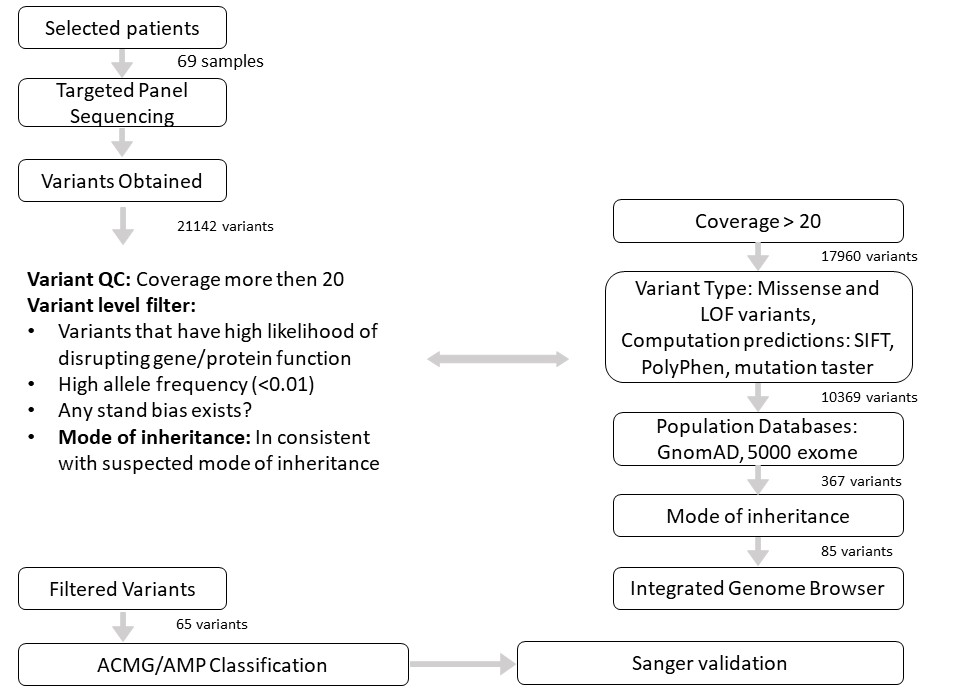

# Deciphering the Mutation Spectrum in South Indian Children With Congenital Anomalies of the Kidney and Urinary Tract

### Hypothesis/Research question
- Can NGS based customized targeted gene panel be used for genetic diagnosis of CAKUT.  
- What is estimated ‘monogenic burden’ in south Indian children with CAKUT.  

### Findings

- Cohort of the size 110 patients and 69 of these patients were genotyped     
| Phenotype | % representation |
| --- | --- |
| Posterior Urethral Valve (PUV) | 39.1 % |
| Vesico-Ureteric Reflux (VUR) | 33.3 % |
| Multi-Cystic Dysplastic Kidney (MCDK) | 7.2 % |

### Samples Sequenced
Total Number of Patients Screened: **110**  
Total Number of Patients Samples sequenced: **69**  
                                        

### Workflow 

- Patients and Clinical data:  
 Children diagnosed with CAKUT (age group: newborn -18 years). Clinical data, laboratory and imaging details were documented
 

- Next generation sequencing:  
 Customized CAKUT NGS panel sequencing using Ion Torrent Personal Genome Machine sequencer
 

- NGS data analysis:  
 Variants were filtered and classified according to the workflow
 
 
### Links for Online Resources/Databases/Tools

| Name | Link |
| --- | --- |
| OMIM | http://omim.org/ |
| PubMed | http://www.ncbi.nlm.nih.gov/pubmed/ |
| gnomAD | https://gnomad.broadinstitute.org/ |
| 5000 Exome | http://evs.gs.washington.edu/EVS/ |
| SIFT | https://sift.bii.a-star.edu.sg/ |
| PolyPhen | http://genetics.bwh.harvard.edu/pph2/ |
| Mutation taster | http://www.mutationtaster.org/ |

### Outcome of the study

| Outcome | Link |
| --- | --- |
| Detailed clinical profile of the patients included in the study | [Clinical Profile](data/Clinical_profile_of_the_cohort.xlsx) |
| Summary of NGS data output | [NGS output](data/Summary_of_NGS_data_output.xlsx) |
| Details of Variants identified in the cohort | [Variants detected](data/Variants_identified_in_the_cohort.xlsx) |
| Pathogenicity risk score calculation | [Risk calculation](data/Pathogenicity_risk_score_calculation.xlsx) |

#### Contact Information

Dr. Anil Vasudevan: anil.vasudevan@sjri.res.in

